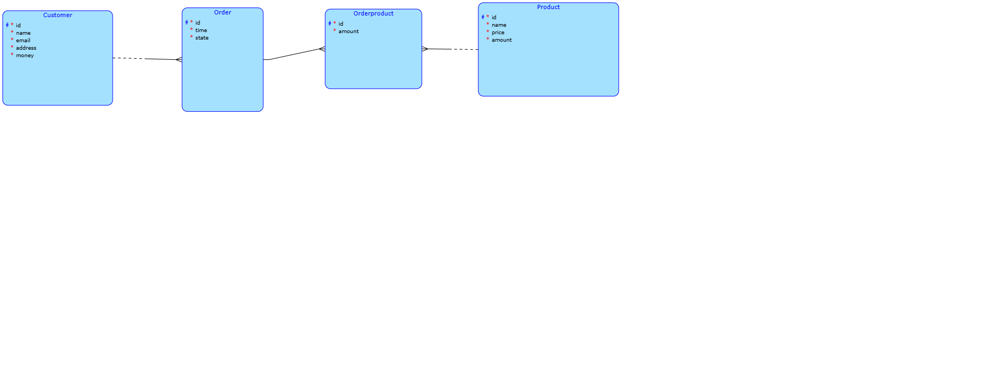

# Simple E-Shop Project  

This project is a straightforward e-shop application where customers can add funds to their account and use them to purchase various products.  

## Key features
- **Back-end:** Developed in Java using the Spring Framework. The application follows a three-layer architecture.
- **Database:** Data is stored in a PostgreSQL database running in a Docker container.
- **Testing:** Includes unit and integration tests.
- **Front-end:** Built in Java using the Vaadin Framework.  

